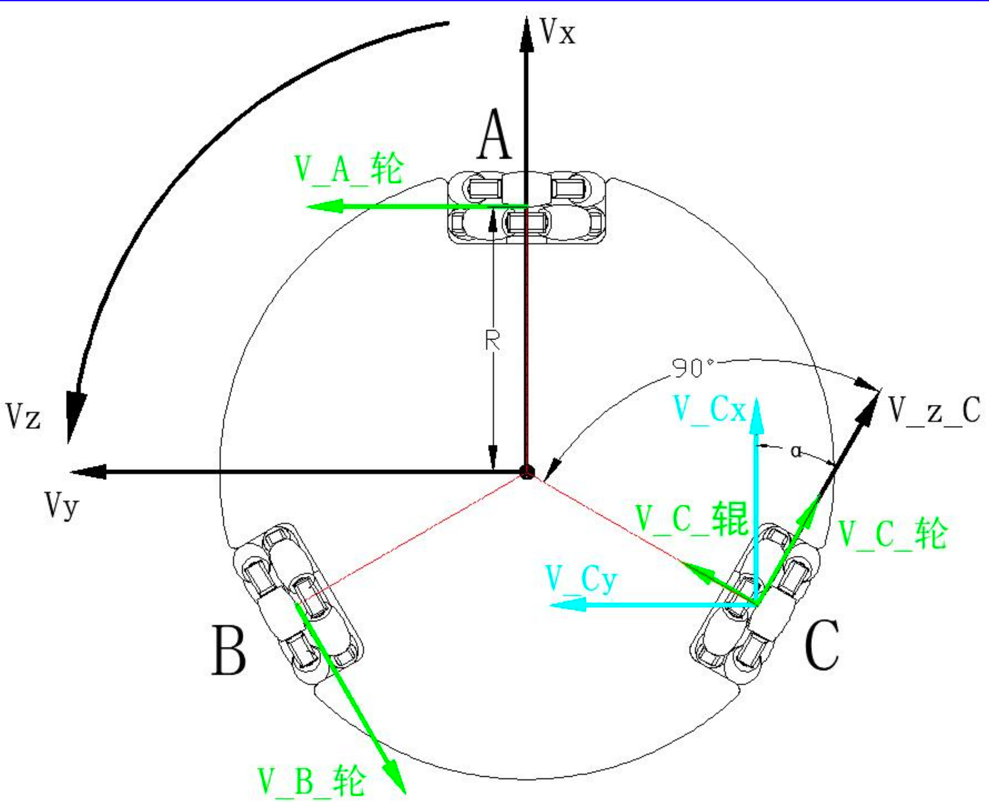
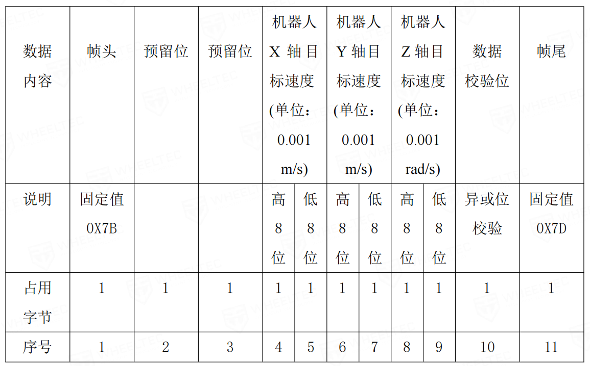
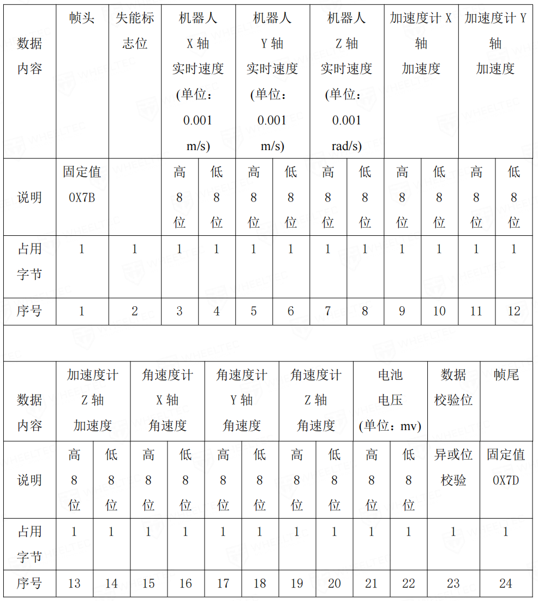

# 哈哈机器人底盘驱动系统

## 系统概述

本文档详细介绍了哈哈机器人底盘的驱动系统。哈哈机器人底盘由三个直径为60mm的全向轮构成，这些轮子通过42步进电机进行驱动。控制系统的核心是STM32F103RCT6微控制器，目前已升级为性能更强的国产GD32F103RCT6。电机驱动部分采用了四路LV8731V步进电机驱动器。

## 技术规格

- **全向轮**: 60mm直径
- **步进电机**: 42型
- **主控单元**: GD32F103RCT6（原STM32F103RCT6）
- **电机驱动器**: LV8731V（4路）

## 运动学解析

## 开发计划

以下是底盘驱动系统开发过程中待完成的任务列表：
### 已完成：
- [x] **缓启动修正**: 优化启动算法，确保机器人启动平稳。
- [x] **轮速计算修正**: 调整轮速计算逻辑，提高速度控制精度。
- [x] **OLED显示功能**: 添加OLED显示屏，用于实时显示机器人状态和系统信息。
- [x] **陀螺仪里程计集成**: 引入陀螺仪和里程计，增强机器人的定位和导航能力。
### 正在开发

- [ ] **ROS串口通讯**: 实现与ROS（机器人操作系统）的串口通信，便于集成和远程控制。
- 目前已完成上位机向底盘发送串口指令：

